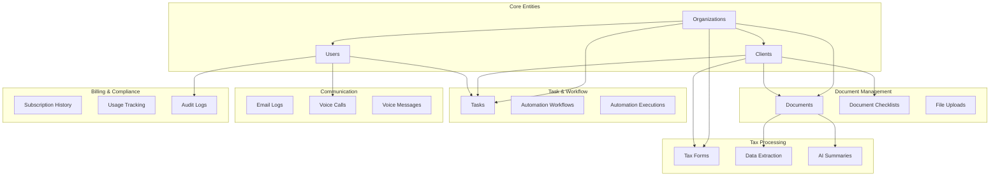
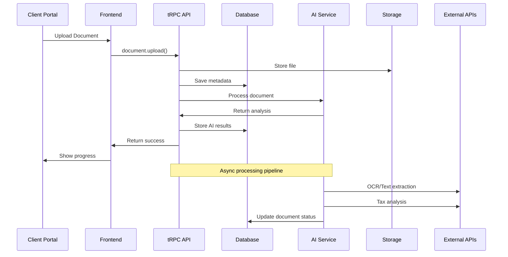

# Neuronize System Architecture Document
## Enterprise-Grade Tax Practice Management Platform

---

## 📋 **Executive Summary**

Neuronize is a comprehensive AI-powered tax practice management SaaS platform designed for high-tier tax practices. This document provides a complete technical blueprint for building an enterprise-grade solution that combines advanced automation, AI capabilities, and professional-grade user experience to serve premium tax practices managing large client bases.

---

## 🏗️ **1. COMPLETE FEATURE BREAKDOWN**

### **🔥 HIGH PRIORITY FEATURES (Core Revenue Drivers)**

#### **1.1 Automated Client Onboarding**
**Business Value**: Reduces onboarding time by 80%, improves client experience
**Technical Complexity**: Medium
**Dependencies**: Authentication, Client Management, Document Collection

**Components**:
- Multi-step onboarding wizard with progress tracking
- Automated folder creation and CRM integration
- Dynamic form generation based on client type
- Real-time validation and data quality checks
- Automated welcome sequences and task creation

**Technical Requirements**:
- React multi-step form components
- Supabase real-time subscriptions
- File system automation
- Email automation integration
- Progress persistence and recovery

#### **1.2 Tax Document Collection & Monitoring**
**Business Value**: Core differentiator, reduces manual follow-up by 90%
**Technical Complexity**: High
**Dependencies**: Client Management, File Storage, AI Processing

**Components**:
- Personalized document checklists by client type/history
- Secure document upload portal with drag-and-drop
- Real-time upload tracking and progress indicators
- Automated missing document alerts (email/SMS)
- Document categorization and OCR processing
- Client-facing document portal

**Technical Requirements**:
- Supabase Storage with security policies
- File processing pipeline
- OCR integration (Google Vision API)
- Email/SMS automation
- Real-time progress tracking
- Mobile-responsive upload interface

#### **1.3 AI Document Summarization**
**Business Value**: Saves 3-4 hours per client, improves accuracy
**Technical Complexity**: High
**Dependencies**: Document Collection, AI Service, File Processing

**Components**:
- AI-powered analysis of K-1s, brokerage statements, tax documents
- Key data point extraction (income, deductions, credits)
- Summary generation with tax implications
- Anomaly detection for unusual transactions
- Integration with tax preparation software

**Technical Requirements**:
- OpenRouter AI integration with specialized models
- Document parsing and text extraction
- Structured data extraction pipelines
- Tax knowledge base integration
- Professional report generation

#### **1.4 Tax Form Auto-Fill**
**Business Value**: Reduces form preparation time by 70%, minimizes errors
**Technical Complexity**: Very High
**Dependencies**: Document Summarization, Client Data, E-signature

**Components**:
- Data mapping from intake forms and documents to tax forms
- Support for standard forms (1040, 1099s, W-9, etc.)
- PDF generation with pre-filled data
- E-signature routing and tracking
- Version control and audit trails
- Integration with professional tax software

**Technical Requirements**:
- PDF generation library (PDF-lib)
- Form template management system
- Data mapping engine
- DocuSign integration
- Version control system
- Tax software API integrations

#### **1.5 AI Assistant/Chatbot**
**Business Value**: 24/7 client support, reduces staff workload by 60%
**Technical Complexity**: Medium
**Dependencies**: AI Service, Knowledge Base, Client Context

**Components**:
- Website and portal integration
- Natural language processing for tax queries
- Knowledge base integration
- Escalation to human staff
- Multi-language support
- Learning from interactions

**Technical Requirements**:
- OpenRouter integration with conversation memory
- Knowledge base vector search
- Escalation workflow system
- Multi-language NLP models
- Conversation analytics
- Integration with support ticketing

### **🚀 MEDIUM PRIORITY FEATURES (Operational Excellence)**

#### **2.1 Advanced Task Management**
**Business Value**: Improves team productivity by 40%, ensures deadline compliance
**Technical Complexity**: Medium
**Dependencies**: Client Management, User Management, Notifications

**Components**:
- Visual task dashboard (Kanban/List views)
- Task templates for common workflows
- Automated task creation from triggers
- Due date tracking and escalation
- Team collaboration and assignment
- Performance analytics

#### **2.2 Bookkeeping Automations**
**Business Value**: Reduces bookkeeping time by 50%, improves accuracy
**Technical Complexity**: High
**Dependencies**: Bank Integrations, AI Processing, Client Data

**Components**:
- Automatic bank transaction import
- AI-powered transaction categorization
- Anomaly detection and flagging
- Monthly financial summary generation
- Reconciliation assistance
- QuickBooks integration

#### **2.3 Payroll Coordination**
**Business Value**: Streamlines payroll processing, ensures compliance
**Technical Complexity**: High
**Dependencies**: Client Data, Tax Calculations, Compliance Tracking

**Components**:
- Payroll data import and validation
- Tax calculation automation
- Compliance checking and alerts
- Integration with payroll providers
- Quarterly reporting automation

#### **2.4 Email Campaign Management**
**Business Value**: Improves client communication, automates marketing
**Technical Complexity**: Medium
**Dependencies**: Client Segmentation, Template System, Analytics

**Components**:
- Email template library
- Client segmentation and targeting
- Automated campaign sequences
- Performance tracking and analytics
- A/B testing capabilities
- Compliance with email regulations

### **⚡ LOW PRIORITY FEATURES (Competitive Advantages)**

#### **3.1 1099 Compliance Automation**
**Business Value**: Ensures compliance, reduces manual work
**Technical Complexity**: High
**Dependencies**: Client Data, Tax Calculations, E-filing

**Components**:
- Automated 1099 generation
- Compliance checking and validation
- E-filing integration
- Recipient notification system
- Correction and amendment handling

#### **3.2 Voice Agent Integration**
**Business Value**: Premium client experience, 24/7 availability
**Technical Complexity**: Very High
**Dependencies**: AI Service, Phone System, CRM Integration

**Components**:
- VAPI integration for voice calls
- Voice-to-text transcription
- AI-powered response generation
- Call routing and escalation
- Call analytics and reporting

#### **3.3 Partner Dashboard**
**Business Value**: Expands service offerings, creates partnerships
**Technical Complexity**: Medium
**Dependencies**: API Management, Authentication, Data Sharing

**Components**:
- Partner portal with limited access
- API access management
- Data sharing controls
- Partner performance analytics
- White-label capabilities

#### **3.4 Advanced Compliance Alerts**
**Business Value**: Proactive compliance management
**Technical Complexity**: High
**Dependencies**: Regulatory Database, AI Monitoring, Notification System

**Components**:
- Regulatory change monitoring
- Automated compliance checking
- Proactive alert system
- Compliance reporting
- Audit trail management

---

## 🛣️ **2. TECHNICAL IMPLEMENTATION ROADMAP**

### **Phase 1: Foundation Completion (Weeks 1-4)**
**Goal**: Complete core infrastructure and fix existing issues

#### **Week 1: Authentication & Core Infrastructure**
- ✅ **COMPLETED**: Authentication system fixes
- ✅ **COMPLETED**: Demo mode implementation
- ✅ **COMPLETED**: tRPC context improvements
- 🔧 **TODO**: Database schema deployment to production
- 🔧 **TODO**: Environment configuration standardization

#### **Week 2: Client Management Enhancement**
**Dependencies**: Authentication system
**Estimated Time**: 32 hours
- Client detail pages with comprehensive information display
- Advanced search and filtering capabilities
- Client document organization and access controls
- Staff assignment and management workflows

**Technical Tasks**:
```typescript
// Client detail page components
- ClientDetailPage.tsx
- ClientDocumentSection.tsx
- ClientTaskSection.tsx
- ClientCommunicationHistory.tsx

// Enhanced tRPC procedures
- client.getById with full relations
- client.updateAssignments
- client.getDocumentSummary
```

#### **Week 3: Document Collection System - Core**
**Dependencies**: Client Management, File Storage
**Estimated Time**: 40 hours
- Document checklist creation and management
- File upload interface with progress tracking
- Document categorization system
- Basic progress indicators

**Technical Tasks**:
```typescript
// Core components
- DocumentChecklistManager.tsx
- FileUploadZone.tsx
- DocumentCategorySelector.tsx
- ProgressTracker.tsx

// Database integration
- Real document_checklists table usage
- File metadata storage
- Progress calculation logic
```

#### **Week 4: Document Collection System - Advanced**
**Dependencies**: Week 3 completion
**Estimated Time**: 36 hours
- Client document portal
- Automated missing document alerts
- Admin monitoring dashboard
- Mobile-responsive interface

### **Phase 2: Core Feature Development (Weeks 5-12)**

#### **Weeks 5-6: Task Management System**
**Dependencies**: Client Management
**Estimated Time**: 48 hours
- Visual task dashboard (Kanban and list views)
- Task creation and assignment workflows
- Due date tracking and notifications
- Task templates for common workflows

**Technical Implementation**:
```typescript
// Task management components
- TaskDashboard.tsx (Kanban/List toggle)
- TaskCard.tsx with drag-and-drop
- TaskCreationModal.tsx
- TaskTemplateManager.tsx

// Real-time updates
- Supabase real-time subscriptions
- Optimistic UI updates
- Conflict resolution
```

#### **Weeks 7-8: AI Document Processing**
**Dependencies**: Document Collection, AI Service
**Estimated Time**: 56 hours
- Document text extraction and OCR
- AI-powered document analysis
- Data extraction pipelines
- Summary generation with tax insights

**Technical Implementation**:
```typescript
// AI processing pipeline
- DocumentProcessor.ts
- OCRService.ts (Google Vision API)
- TaxDocumentAnalyzer.ts
- DataExtractionEngine.ts

// Integration points
- File upload triggers
- Processing status tracking
- Result storage and retrieval
```

#### **Weeks 9-10: Tax Form Auto-Fill Foundation**
**Dependencies**: AI Document Processing
**Estimated Time**: 64 hours
- Form template system
- Data mapping engine
- PDF generation capabilities
- Basic form population logic

**Technical Implementation**:
```typescript
// Form system
- FormTemplateManager.ts
- DataMappingEngine.ts
- PDFGenerator.ts (using PDF-lib)
- FormPopulator.ts

// Form templates
- Form1040Template.ts
- Form1099Template.ts
- W9Template.ts
```

#### **Weeks 11-12: E-signature Integration**
**Dependencies**: Tax Form Auto-Fill
**Estimated Time**: 40 hours
- DocuSign integration
- E-signature workflow management
- Document tracking and status updates
- Completion notifications

### **Phase 3: Advanced Features (Weeks 13-20)**

#### **Weeks 13-14: Automated Client Onboarding**
**Dependencies**: Client Management, Document Collection, Task Management
**Estimated Time**: 48 hours
- Multi-step onboarding wizard
- Progress tracking and persistence
- Automated folder and task creation
- Welcome sequence automation

#### **Weeks 15-16: Advanced AI Features**
**Dependencies**: AI Document Processing
**Estimated Time**: 56 hours
- Enhanced document summarization
- Anomaly detection in financial documents
- Tax planning recommendations
- Integration with tax preparation software

#### **Weeks 17-18: Automation Workflows**
**Dependencies**: All core features
**Estimated Time**: 64 hours
- Visual workflow builder
- Trigger system (events, schedules, webhooks)
- Action library (emails, tasks, notifications)
- Execution monitoring and logging

#### **Weeks 19-20: Billing & Subscription Management**
**Dependencies**: User Management, Usage Tracking
**Estimated Time**: 48 hours
- Stripe integration
- Usage tracking and limits
- Billing dashboard
- Plan management

### **Phase 4: Premium Features (Weeks 21-28)**

#### **Weeks 21-22: Voice Agent Integration**
**Dependencies**: AI Service, Phone System
**Estimated Time**: 56 hours
- VAPI integration
- Voice-to-text processing
- AI response generation
- Call management dashboard

#### **Weeks 23-24: Advanced Bookkeeping**
**Dependencies**: Bank Integrations, AI Processing
**Estimated Time**: 64 hours
- Bank transaction import
- AI categorization
- Reconciliation assistance
- QuickBooks integration

#### **Weeks 25-26: Email Campaign Management**
**Dependencies**: Client Segmentation, Template System
**Estimated Time**: 40 hours
- Email template system
- Campaign automation
- Performance analytics
- A/B testing

#### **Weeks 27-28: Compliance & Reporting**
**Dependencies**: All data systems
**Estimated Time**: 48 hours
- Compliance monitoring
- Advanced reporting
- Audit trails
- Regulatory alerts

---

## 🏛️ **3. SYSTEM ARCHITECTURE OVERVIEW**

### **3.1 Database Architecture**



### **3.2 API Architecture (tRPC Routers)**

```typescript
// Router Organization
export const appRouter = createTRPCRouter({
  // Core Management
  user: userRouter,                    // User CRUD, profile, preferences
  organization: organizationRouter,    // Org settings, billing, limits
  client: clientRouter,               // Client management, assignments

  // Document Processing
  document: documentRouter,           // File upload, metadata, search
  documentChecklist: documentChecklistRouter, // Checklist CRUD, progress

  // Task & Workflow
  task: taskRouter,                   // Task management, assignments
  automation: automationRouter,       // Workflow creation, execution

  // Tax Processing
  taxForm: taxFormRouter,            // Form generation, e-signature
  ai: aiRouter,                      // AI processing, summarization

  // Communication
  voice: voiceRouter,                // Voice calls, transcription
  email: emailRouter,                // Email campaigns, templates

  // Business Operations
  onboarding: onboardingRouter,      // Client onboarding workflows
  subscription: subscriptionRouter,   // Billing, usage tracking
  settings: settingsRouter,          // System configuration
})
```

### **3.3 Frontend Component Hierarchy**

```
src/
├── app/                           # Next.js 14 App Router
│   ├── dashboard/                 # Protected dashboard routes
│   │   ├── clients/              # Client management pages
│   │   ├── documents/            # Document management
│   │   ├── tasks/                # Task management
│   │   ├── ai-assistant/         # AI chat interface
│   │   ├── tax-forms/            # Form generation
│   │   ├── automation/           # Workflow management
│   │   ├── voice-agent/          # Voice call management
│   │   ├── billing/              # Subscription management
│   │   └── reports/              # Analytics dashboard
│   ├── auth/                     # Authentication pages
│   ├── api/                      # API routes
│   └── (public)/                 # Public marketing pages
│
├── components/
│   ├── layout/                   # Layout components
│   │   ├── DashboardLayout.tsx
│   │   ├── Sidebar.tsx
│   │   └── Header.tsx
│   ├── dashboard/                # Dashboard widgets
│   │   ├── DashboardOverview.tsx
│   │   ├── DocumentCollectionWidget.tsx
│   │   ├── TaskSummaryWidget.tsx
│   │   └── ClientMetricsWidget.tsx
│   ├── clients/                  # Client management
│   │   ├── ClientList.tsx
│   │   ├── ClientDetail.tsx
│   │   ├── ClientOnboarding.tsx
│   │   └── ClientDocuments.tsx
│   ├── documents/                # Document management
│   │   ├── DocumentUpload.tsx
│   │   ├── DocumentChecklist.tsx
│   │   ├── DocumentViewer.tsx
│   │   └── ProgressTracker.tsx
│   ├── tasks/                    # Task management
│   │   ├── TaskDashboard.tsx
│   │   ├── TaskCard.tsx
│   │   ├── TaskCreation.tsx
│   │   └── TaskTemplates.tsx
│   ├── ai/                       # AI components
│   │   ├── ChatInterface.tsx
│   │   ├── DocumentAnalysis.tsx
│   │   ├── AIInsights.tsx
│   │   └── ModelSelector.tsx
│   ├── forms/                    # Tax form components
│   │   ├── FormBuilder.tsx
│   │   ├── FormPreview.tsx
│   │   ├── DataMapping.tsx
│   │   └── ESignature.tsx
│   └── ui/                       # Reusable UI components
```

### **3.4 Third-Party Integrations**

```typescript
// Integration Architecture
interface IntegrationLayer {
  // Core Infrastructure
  database: 'Supabase PostgreSQL',
  authentication: 'Supabase Auth + NextAuth.js',
  storage: 'Supabase Storage',

  // AI & Processing
  aiModels: 'OpenRouter (Claude, GPT, Llama, Gemini)',
  ocr: 'Google Vision API',
  documentProcessing: 'PDF-lib, pdf2pic',

  // Business Integrations
  eSignature: 'DocuSign API',
  accounting: 'QuickBooks Online API',
  banking: 'Plaid API',
  payroll: 'Gusto API, ADP API',

  // Communication
  email: 'Supabase Email + SendGrid',
  sms: 'Twilio API',
  voice: 'VAPI (Voice AI Platform)',

  // Payments & Billing
  payments: 'Stripe API',
  billing: 'Stripe Billing',

  // Compliance & Security
  encryption: 'Supabase RLS + Custom encryption',
  audit: 'Custom audit logging',
  backup: 'Supabase automated backups'
}
```

### **3.5 Data Flow Architecture**



---

## 🏢 **4. HIGH-TIER CLIENT REQUIREMENTS**

### **4.1 Enterprise-Grade Security & Compliance**

#### **Security Framework**
```typescript
interface SecurityRequirements {
  dataEncryption: {
    atRest: 'AES-256 encryption for all sensitive data',
    inTransit: 'TLS 1.3 for all communications',
    clientData: 'Field-level encryption for PII/financial data'
  },

  accessControl: {
    authentication: 'Multi-factor authentication required',
    authorization: 'Role-based access control (RBAC)',
    sessionManagement: 'Secure JWT with rotation',
    apiSecurity: 'Rate limiting, API key management'
  },

  compliance: {
    standards: ['SOC 2 Type II', 'GDPR', 'CCPA', 'IRS Publication 1075'],
    auditTrails: 'Complete audit logging for all actions',
    dataRetention: 'Configurable retention policies',
    rightToErasure: 'GDPR-compliant data deletion'
  },

  infrastructure: {
    hosting: 'SOC 2 compliant cloud infrastructure',
    backups: 'Encrypted daily backups with 7-year retention',
    monitoring: '24/7 security monitoring and alerting',
    incidentResponse: 'Documented incident response procedures'
  }
}
```

#### **Implementation Requirements**
- **Row Level Security (RLS)**: All database tables must have RLS policies
- **Field-Level Encryption**: SSN, bank accounts, financial data
- **Audit Logging**: Every action logged with user, timestamp, IP, changes
- **Data Classification**: Automatic PII detection and protection
- **Secure File Storage**: Encrypted storage with access controls
- **API Security**: Rate limiting, request validation, SQL injection prevention

### **4.2 Scalability for Large Client Bases**

#### **Performance Requirements**
```typescript
interface ScalabilityRequirements {
  performance: {
    pageLoadTime: '< 2 seconds for all pages',
    apiResponseTime: '< 500ms for 95% of requests',
    fileUploadSpeed: '> 10MB/s for document uploads',
    concurrentUsers: 'Support 1000+ concurrent users per organization'
  },

  capacity: {
    clientsPerOrg: 'Support 10,000+ clients per organization',
    documentsPerClient: 'Support 1,000+ documents per client',
    storagePerOrg: 'Support 1TB+ storage per organization',
    apiCallsPerMonth: 'Support 1M+ API calls per organization'
  },

  availability: {
    uptime: '99.9% uptime SLA',
    maintenance: 'Scheduled maintenance windows < 4 hours/month',
    disaster: 'RTO < 4 hours, RPO < 1 hour',
    monitoring: 'Real-time performance monitoring'
  }
}
```

#### **Technical Implementation**
- **Database Optimization**: Proper indexing, query optimization, connection pooling
- **Caching Strategy**: Redis for session data, CDN for static assets
- **File Processing**: Async processing queues for large file operations
- **Real-time Updates**: Efficient WebSocket connections with Supabase
- **Load Balancing**: Auto-scaling infrastructure
- **Database Sharding**: Organization-based data partitioning

### **4.3 Professional UI/UX Standards**

#### **Design System Requirements**
```typescript
interface UIUXRequirements {
  designSystem: {
    components: 'Consistent component library (Shadcn/ui)',
    typography: 'Professional typography hierarchy',
    colorPalette: 'Accessible color system (WCAG AA)',
    spacing: 'Consistent spacing and layout grid'
  },

  userExperience: {
    navigation: 'Intuitive navigation with breadcrumbs',
    search: 'Global search with intelligent filtering',
    responsiveness: 'Mobile-first responsive design',
    accessibility: 'WCAG 2.1 AA compliance'
  },

  branding: {
    whiteLabel: 'Customizable branding for organizations',
    themes: 'Light/dark theme support',
    customization: 'Configurable dashboard layouts',
    professional: 'Enterprise-grade visual design'
  },

  performance: {
    loading: 'Skeleton loading states for all components',
    feedback: 'Clear success/error messaging',
    offline: 'Offline capability for critical functions',
    progressive: 'Progressive web app (PWA) features'
  }
}
```

#### **Implementation Standards**
- **Component Library**: Consistent, reusable components
- **Responsive Design**: Mobile-first approach with breakpoints
- **Loading States**: Skeleton screens and progress indicators
- **Error Handling**: User-friendly error messages and recovery
- **Accessibility**: Screen reader support, keyboard navigation
- **Performance**: Code splitting, lazy loading, image optimization

### **4.4 Advanced Automation & AI Capabilities**

#### **AI-Powered Features**
```typescript
interface AICapabilities {
  documentProcessing: {
    ocr: 'Advanced OCR with 99%+ accuracy',
    extraction: 'Intelligent data extraction from tax documents',
    categorization: 'Automatic document categorization',
    validation: 'AI-powered data validation and error detection'
  },

  taxPreparation: {
    autoFill: 'Intelligent form auto-fill with 95%+ accuracy',
    recommendations: 'Tax planning recommendations',
    compliance: 'Automatic compliance checking',
    optimization: 'Tax optimization suggestions'
  },

  clientService: {
    chatbot: '24/7 AI assistant with tax expertise',
    voiceAgent: 'AI-powered phone support',
    scheduling: 'Intelligent appointment scheduling',
    communication: 'Automated client communication'
  },

  businessIntelligence: {
    analytics: 'Predictive analytics for practice management',
    insights: 'AI-generated business insights',
    forecasting: 'Revenue and workload forecasting',
    optimization: 'Process optimization recommendations'
  }
}
```

#### **Automation Workflows**
- **Client Onboarding**: Fully automated onboarding process
- **Document Collection**: Automated reminders and follow-ups
- **Task Management**: Intelligent task creation and assignment
- **Deadline Tracking**: Proactive deadline management
- **Compliance Monitoring**: Automated compliance checking
- **Reporting**: Automated report generation and distribution

---

## 📊 **5. CURRENT STATE VS. TARGET STATE**

### **5.1 Current State Analysis**

#### **✅ COMPLETED & TESTED**
```typescript
interface CompletedFeatures {
  authentication: {
    status: 'Production Ready',
    features: [
      'Supabase Auth integration',
      'Email verification',
      'Password reset',
      'Session management',
      'Route protection',
      'Demo mode fallback'
    ],
    testingStatus: 'Fully tested and validated',
    documentation: 'Complete'
  },

  infrastructure: {
    status: 'Production Ready',
    features: [
      'Next.js 14 app router',
      'tRPC API layer',
      'Supabase database',
      'Component library',
      'Responsive layout'
    ],
    testingStatus: 'Tested',
    documentation: 'Complete'
  },

  aiAssistant: {
    status: 'Production Ready',
    features: [
      'Multi-model AI chat',
      'File upload and analysis',
      'Conversation history',
      'Public chatbot'
    ],
    testingStatus: 'Tested',
    documentation: 'Complete'
  }
}
```

#### **🚧 PARTIALLY IMPLEMENTED**
```typescript
interface PartialFeatures {
  clientManagement: {
    status: '60% Complete',
    completed: [
      'Basic CRUD operations',
      'Client listing',
      'Database schema'
    ],
    missing: [
      'Client detail pages',
      'Document organization',
      'Advanced search',
      'Staff assignment UI'
    ],
    estimatedCompletion: '2 weeks'
  },

  documentManagement: {
    status: '40% Complete',
    completed: [
      'File upload component',
      'Database schema',
      'Basic tRPC operations'
    ],
    missing: [
      'Document viewer',
      'Categorization UI',
      'Progress tracking',
      'AI processing integration'
    ],
    estimatedCompletion: '3 weeks'
  },

  taskManagement: {
    status: '30% Complete',
    completed: [
      'Database schema',
      'tRPC operations',
      'Documentation'
    ],
    missing: [
      'Task dashboard UI',
      'Kanban interface',
      'Assignment workflows',
      'Notification system'
    ],
    estimatedCompletion: '2 weeks'
  }
}
```

#### **❌ NOT STARTED**
```typescript
interface PendingFeatures {
  documentCollection: {
    status: 'Not Started',
    priority: 'High',
    dependencies: ['Client Management', 'Document Management'],
    estimatedTime: '4 weeks',
    complexity: 'High'
  },

  taxFormAutoFill: {
    status: 'Not Started',
    priority: 'High',
    dependencies: ['Document Processing', 'AI Integration'],
    estimatedTime: '6 weeks',
    complexity: 'Very High'
  },

  automationWorkflows: {
    status: 'Not Started',
    priority: 'Medium',
    dependencies: ['All Core Features'],
    estimatedTime: '4 weeks',
    complexity: 'High'
  },

  voiceAgent: {
    status: 'Not Started',
    priority: 'Low',
    dependencies: ['AI Service', 'VAPI Integration'],
    estimatedTime: '3 weeks',
    complexity: 'Very High'
  }
}
```

### **5.2 Integration Points**

#### **Existing → New Feature Integration**
```typescript
interface IntegrationMap {
  authenticationSystem: {
    integrates_with: [
      'All new features (session management)',
      'Role-based access control',
      'Audit logging',
      'Organization isolation'
    ]
  },

  aiAssistant: {
    integrates_with: [
      'Document processing (analysis)',
      'Tax form auto-fill (data extraction)',
      'Client communication (chatbot)',
      'Voice agent (AI responses)'
    ]
  },

  databaseSchema: {
    integrates_with: [
      'All features (data persistence)',
      'Real-time updates',
      'Audit trails',
      'Performance optimization'
    ]
  },

  tRPCAPI: {
    integrates_with: [
      'All frontend components',
      'Real-time subscriptions',
      'Type safety',
      'Error handling'
    ]
  }
}
```

### **5.3 Target State Architecture**

#### **Complete Feature Matrix**
```typescript
interface TargetState {
  coreFeatures: {
    clientOnboarding: 'Fully automated multi-step process',
    documentCollection: 'AI-powered collection and monitoring',
    documentSummarization: 'Advanced AI analysis and insights',
    taxFormAutoFill: 'Intelligent form population',
    aiAssistant: 'Advanced conversational AI'
  },

  operationalFeatures: {
    taskManagement: 'Visual workflow management',
    bookkeepingAutomation: 'AI-powered transaction processing',
    payrollCoordination: 'Integrated payroll management',
    emailCampaigns: 'Automated marketing and communication'
  },

  premiumFeatures: {
    voiceAgent: 'AI-powered phone support',
    complianceAutomation: 'Proactive compliance monitoring',
    partnerDashboard: 'White-label partner access',
    advancedAnalytics: 'Predictive business intelligence'
  },

  enterpriseFeatures: {
    customBranding: 'Full white-label customization',
    apiAccess: 'RESTful API for integrations',
    ssoIntegration: 'Enterprise SSO support',
    dedicatedSupport: '24/7 dedicated support team'
  }
}
```

---

## 🔍 **6. QUALITY ASSURANCE STRATEGY**

### **6.1 Testing Procedures**


  e2eTesting: {
    scope: [
      'Complete user workflows',
      'Cross-browser compatibility',
      'Mobile responsiveness',
      'Performance under load'
    ],
    tools: ['Playwright', 'Cypress'],
    frequency: 'Run on staging deployment'
  }
}
```

### **6.2 Performance Benchmarks**

#### **Performance Standards**
```typescript
interface PerformanceBenchmarks {
  pageLoad: {
    target: '< 2 seconds for initial page load',
    measurement: 'Lighthouse performance score > 90',
    monitoring: 'Real User Monitoring (RUM) with Vercel Analytics'
  },

  apiResponse: {
    target: '< 500ms for 95% of API requests',
    measurement: 'P95 response time tracking',
    monitoring: 'tRPC built-in performance monitoring'
  },

  fileUpload: {
    target: '> 10MB/s upload speed for documents',
    measurement: 'Upload progress tracking',
    monitoring: 'Supabase Storage performance metrics'
  },

  realTimeUpdates: {
    target: '< 100ms latency for real-time updates',
    measurement: 'WebSocket connection performance',
    monitoring: 'Supabase real-time metrics'
  }
}
```

### **6.3 Security Validation Requirements**

#### **Security Testing Framework**
```typescript
interface SecurityValidation {
  authentication: {
    tests: [
      'Session management and JWT validation',
      'Password strength and reset flows',
      'Multi-factor authentication workflows',
      'Role-based access control enforcement'
    ],
    tools: ['OWASP ZAP', 'Custom security test suite'],
    frequency: 'Every release'
  },

  dataProtection: {
    tests: [
      'Data encryption at rest and in transit',
      'PII data handling and masking',
      'SQL injection prevention',
      'XSS and CSRF protection'
    ],
    tools: ['Snyk', 'SonarQube', 'Custom penetration testing'],
    frequency: 'Monthly security audits'
  },

  compliance: {
    tests: [
      'GDPR compliance validation',
      'Audit trail completeness',
      'Data retention policy enforcement',
      'Right to erasure implementation'
    ],
    tools: ['Custom compliance test suite'],
    frequency: 'Quarterly compliance reviews'
  }
}
```

### **6.4 User Acceptance Criteria**

#### **Feature Acceptance Standards**
```typescript
interface AcceptanceCriteria {
  functionalRequirements: {
    completeness: 'All user stories must be fully implemented',
    accuracy: 'Business logic must match requirements exactly',
    usability: 'Features must be intuitive and user-friendly',
    accessibility: 'WCAG 2.1 AA compliance required'
  },

  performanceRequirements: {
    speed: 'All interactions must feel responsive',
    reliability: 'Features must work consistently',
    scalability: 'Must handle expected user load',
    availability: 'Must meet uptime requirements'
  },

  securityRequirements: {
    dataProtection: 'All sensitive data must be protected',
    accessControl: 'Proper authorization enforcement',
    auditability: 'All actions must be logged',
    compliance: 'Must meet regulatory requirements'
  }
}
```

### **6.5 Deployment & Monitoring Strategy**

#### **Production Readiness Checklist**
```typescript
interface ProductionReadiness {
  preDeployment: [
    'All tests passing (unit, integration, e2e)',
    'Security scan completed with no critical issues',
    'Performance benchmarks met',
    'Database migrations tested',
    'Environment variables configured',
    'Monitoring and alerting set up'
  ],

  postDeployment: [
    'Health checks passing',
    'Error rates within acceptable limits',
    'Performance metrics meeting targets',
    'User acceptance testing completed',
    'Rollback plan tested and ready',
    'Documentation updated'
  ],

  monitoring: [
    'Application performance monitoring (APM)',
    'Error tracking and alerting',
    'User behavior analytics',
    'Security monitoring and alerts',
    'Infrastructure monitoring',
    'Business metrics tracking'
  ]
}
```

---

## 🎯 **CONCLUSION**

This comprehensive system architecture document provides the complete blueprint for building Neuronize as an enterprise-grade tax practice management platform. The roadmap prioritizes core revenue-driving features while ensuring scalability, security, and professional-grade user experience.

### **Key Success Factors**:
1. **Phased Development**: Systematic approach with clear dependencies
2. **Quality Focus**: Comprehensive testing and validation at every stage
3. **Enterprise Standards**: Security, compliance, and scalability built-in
4. **AI Integration**: Advanced automation capabilities throughout
5. **User-Centric Design**: Professional UI/UX standards for high-tier clients

### **Next Steps**:
1. Begin Phase 2 development with Document Collection System
2. Implement comprehensive testing strategy
3. Set up production monitoring and alerting
4. Establish security validation procedures
5. Create detailed feature specifications for each development phase

This architecture ensures Neuronize will compete effectively with enterprise solutions while providing the AI-powered automation advantages that justify premium pricing for high-tier tax practices.
